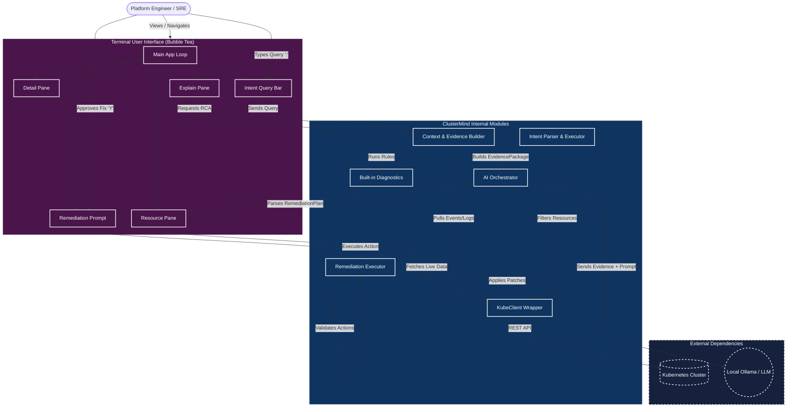

# ClusterMind Architecture

You can import this directly into **Draw.io**:
1. Open [Draw.io](https://app.diagrams.net/)
2. Go to **Arrange** -> **Insert** -> **Advanced** -> **Mermaid**
3. Paste the code block below and click **Insert**

